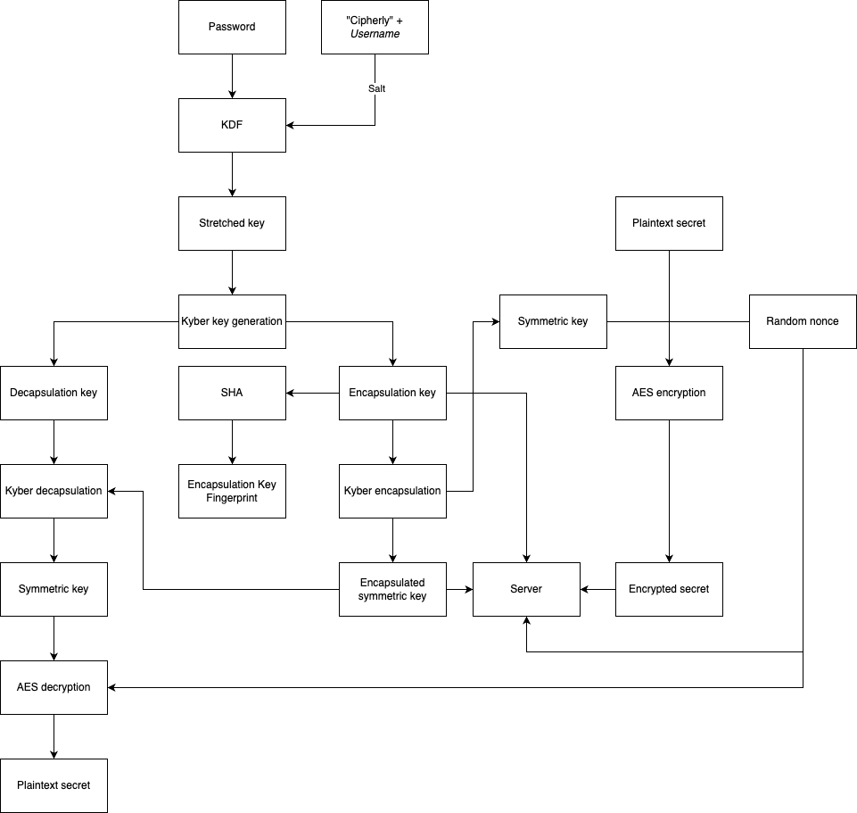

= Cipherly: a secure way to exchange secrets
:toc:

== Motivation

Cipherly was built to enable people to securely share secrets.
The main goals are post quantum security and usability, while minimizing the chance for human error by eliminating the need to exchange sensitive information (shared keys) or store private keys.

== Usage

The following paragraphs describe the exchange of a secret from a users perspective without diving into cryptographic details.

Every user that wants to be able to receive secrets has to register for an account, choosing a username and password.
The password is the basis for protecting all secrets shared with them.


Other people - without the need to create their own account - can share a secret with registered users by entering the recipients username and the secret.
The sender receives a link which identifies the secret.
The link can then be shared with the recipient using already established communication channels.
Since the link does not contain the secret or data used to decrypt the secret, it can be shared using unsafe means of communication.

When the recipient visits the provided link, their password is used to decrypt the secret and the original text is revealed.

=== Recipient verfication

When a user creates an account, they get a _fingerprint_ associated with their account, represented as a string of numbers and digits (this is a simplification, see <<Encapsulation Key fingerprints>> for a detailed explanation).
They can share this information with other people to allow them to verify that they are sharing a secret with the correct person.

Upon registration, users receive a link that contains both their username and fingerprint.
When a user visits the link to share a secret, the fingerprint is automatically validated using the information included in the link.
If the fingerprints do not match, the account might be compromised and any secret shared form now on may be accessed by another person.

To test the verification process, you can simply visit the side via a profile link with a modified fingerprint.

== Cryptographic design

In this section the cryptographic details of the implementation are explained.
After a short introduction to the involved cryptographic primitives and a short summary of the system, a step by step explanation of the <<Registration/Key generation>>, <<Secret encryption>> and <<Secret decryption>> is given.


=== Cryptographic Primitives

==== ML-KEM (Kyber)

ML-KEM - formerly known as Kyber - is one of the post quantum algoithms https://www.nist.gov/news-events/news/2024/08/nist-releases-first-3-finalized-post-quantum-encryption-standards[recently standardized by NIST].
KEM stands for _Key Encapsulation Mechanism_, a type of algorithm that allows two parties to exchange a secret key without sending it in plaintext.

A KEM comes with three functions:footnote:[https://blog.cloudflare.com/post-quantum-key-encapsulation/]

- `generate` creates two keys, a public _encapsulation key_ and a private _decapsulation key_
- `encapsulate` takes the encapsulation key and returns a _shared secret_ and a _ciphertext_. Alice can use Bob's encapsulation key to create a shared secret that she will be able to view in plaintext. She will also get an _encapsulated_ version only Bob can read.
- `decapsulate` uses the _decapsulation_ key to decrypt the encapsulated secret and get the shared secret. Bob uses his decapsulation key to read the shared secret Alice created.

The capability of exchanging the secret key is used a the core of Cipherly and eliminates the need for both users to manually agree on a shared secret key.

==== AES

AES-GCM-SIV is used to encrypt the secret with a symmetric key previously generated using ML-KEM.

==== argon2id KDF

To generate material for the ML-KEM key pair is derived from the password the password chosen by the user.
In accordance to https://www.bsi.bund.de/SharedDocs/Downloads/DE/BSI/Publikationen/TechnischeRichtlinien/TR02102/BSI-TR-02102.pdf?__blob=publicationFile&v=10[BSI TR-02102-1], (part B.1.3.) `argon2id` is used as key derivation function.
Parameter choice followes the recommendations from https://datatracker.ietf.org/doc/rfc9106/[RFC9106] with lower RAM usage:

- t=3 iterations
- p=4 lanes
- 64 MiB of RAM
- tag size (output length) of 512 bits instead of the recommended 256 bits, to meet the requirements of the Kyber key pair generation
- the salt is "cipherly" followed by the username with at least 8 characters in length, giving a minimum length of 16 characters

==== SHA

Sha3 is used to generate the 256bit fingerprint of the encapsulation key.

=== Overview

Cipherly uses a combination of symetric and asymetric cryptography.
The secrets themselves are AES encrypted by the cient creating a secret.
The symmetric key is protected using the Kyber/ML-KEM Key Encapsulation Algorithm.
The encapsulation and decapsulation keys are generated from the users password.
The encapsulation key is stored in the database and available to the public.

The decapsulation key does not leave the client and is never shared with another party.

When a secret is created, the symmetric key is generated by the client and protected using the recipients encapsulation key before it is send to the server.
Only the recipient is able to decapsulate the symmetric key using their private decapsulation key and decrypt the secret.

While AES alone would be anough to implement a platform where users can exchange secrets, using Kybers key encapsulation capabilities reduces the risk of user errors because there is no need to exchange a secret key.

=== Registration/Key generation

- Alice chooses her username and  password
- Using a Key derivation function, 512bits are generated from the password
- From these bits, a Kyber key pair is generated
- The encapsulation key is stored on the server and available for other users

=== Secret encryption


- Bob fetches Alices encapsulation key form the server
- Bob enters the secret
- The secrets is encrypted using AES with a randomly generated symmetric key
- The symmetric key is encapsulated (encrypted) using Alices encapsulation key
- The encrypted secret and the encapsulated symmetric key are sent to the server

=== Secret decryption

- Alice fetches the encrypted secret and the encapsulated symmetric key from the server
- Alice enters her password to generate her keypair
- Using the decapsulation key, the symmetric key is decapsulated
- Using the symmetric key, the secret is decrypted


=== Encapsulation Key Fingerprints

A possible attack allowing someone else than the recipient to decrypt the symmetric key and thus the secret, is replacing the encapsulation key with one the attacker owns the matching decapsulation key for.
Besides the usual precautions - preventing people from chaingin other peoples encapsulation key - users have the ability to verify the encapsulation key used to decrypt the secret.

The fingerprint is the _SHA3-256_ hash of the encapsulation key.
It is displayed when users create their key.




== Implementation

=== Frontend

A full list of dependencies can be found in the `frontend/Cargo.toml` file.

https://alpinejs.dev[Alpine.js] is used for input handling and updating the UI.

==== Crypthographic Libraries

- Kyber/ML-KEM: https://crates.io/crates/ml-kem[ml-kem]
- AES: https://crates.io/crates/aes-gcm-siv[aes-gcm-siv]
- SHA: https://crates.io/crates/sha3[sha3]
- argon2id: https://crates.io/crates/argon2[argon2]

==== Third party assets

While the Rust dependencies are compiled into the WASM binary, Alpine.js and Pico.css are loaded from a CDN.
They are pinned to specific versions and use SRI hashes footnote:[https://developer.mozilla.org/en-US/docs/Web/Security/Subresource_Integrity] for integrity.

The Heroicons are included in the index.html file and not loaded from a CDN.

=== Backend

The backend is a Rust application providing a REST API over HTTP using _axum_ footnote:[https://crates.io/crates/axum].
All data is stored using _SQlite_ footnote:[https://www.sqlite.org/] and the _sqlx_ crate footnote:[https://crates.io/crates/sqlx].

==== Endpoints

- POST /api/accounts - Create a new account
- GET /api/accounts/:username - Fetch the public key of a user by the username
- POST /api/secrets - Create a new secret
- GET /api/secret/:id` - Fetches a secret by its ID

The request and response bodies are described in `core/src/lib.rs`.

== Veryfing the integrity of Cipherly

Cipherly is designed to be secure.
To verify the claims, the following steps can be taken.

=== Validate the design

See <<Cryptographic design>> for a detailed explanation of the cryptographic primitives used in Cipherly and how they work together.

=== Read the source

An important apect of Cipherly is that passwords and plaintext secrets never leave the browser.
For this reason, auditors should focus in the implementation of the frontend and verify that

- no extra requests are made or other means of leaking the secrets are present
- encryption is implemented as described in <<Cryptographic design>> (`crypto.rs`)
- cryptographic primitives are used correctly

=== Verify the integrity of the frontend (provenance attestation)

Even with a bulletproof open source implementation of the frontend, the backend could be compromised, allowing an attacker to 
serve a modified version of the frontend.

To allow users to verify that the frontend served is built from the source code in the repository, we use build provenance attestation.

The frontend is built in a GitHub action.
During the build process, the https://github.com/actions/attest-build-provenance[attest-build-provenance] action is used to attest the build provenance of the resulting artifacts (html, wasm and js files).
This allows you to verify that the frontend files served are built from the source code in the repository.

As part of the repository, the pipeline configuration itself can be reviewed too.

==== Download the frontend files.

The paths are listed here for convenience, check the browser developer tools to make sure you have verified all the files.

Note that 3rd party assets are not covered here (see <<Third party assets>> for more information).

```sh
wget https://cipherly.xyz/index.html
wget https://cipherly.xyz/secretshare.js
wget https://cipherly.xyz/secretshare_bg.wasm
```

The path of this file might change, check the browser developer tools for the correct path.

```sh
wget https://cipherly.xyz/snippets/secretshare-439caabd60b6b6c4/inline0.js
```

==== Using the GitHub CLI

Install the GitHub CLI: https://cli.github.com/[GitHub CLI].


```sh
gh attestation verify index.html --repo cipherly-xyz/cipherly
gh attestation verify secretshare.js --repo cipherly-xyz/cipherly
gh attestation verify secretshare_bg.wasm --repo cipherly-xyz/cipherly
gh attestation verify inline0.js --repo cipherly-xyz/cipherly
```

For more iformation, see https://cli.github.com/manual/gh_attestation_verify

===== Without GitHub CLI

You can also calculate the hashes of the files and manually verify the attestation using the reports on GitHub:

https://github.com/cipherly-xyz/cipherly/attestations

== Future work

There are several features that could be added to improve Cipherly in the future.

=== One time secrets

One time secrets are deleted after being decrypted.
It would be not enough to rely on the frontend to trigger secret deletion, so the secrect must be deleted by the backend after it has been fetched.
To avoid DOS attacks an attacker fetches other peoples secrets to trigger their deletion, the backend should implement a challenge response protocol to ensure that the requesting party is able to decrypt the secret.


=== Multiple recipients

This requires some more thought to make an efficient and secure implementation.
Since changes in the cryptography may break existing keys and secrets, this should be implemented with care.

With the current ML-KEM + AES implementation, multiple recipients would require storing the encapsulated symmetric key multiple times, one time for each recipient.
Since the Key Encapsulation Mechanism picks a new message (symmetric key in this case) for each recipient, the symmetric key would have to be encrypted multiple times too.
This would increase the size of transfered data and the amount of data stored on the server.

Furthermore, the encrypted symmetric keys would have to be stored in a way that allows to determine which encapsulated key belongs to which recipient, unless the recipient would fetch all encapsulated keys and the ciphertext and decrypt all of them until one of them yield a valid symmetric key.
This is currently not necessary and would make it easier for an attacker to link a secret to a recipient.

The approach of using a multi-kem like https://github.com/cryptojedi/kyber-mkem[kyber-mkem] needs some investigation too.

=== Fingerprint caching

To increase the usability of the fingerprint verification, the frontend could cache the fingerprints in local storage.

Alternatively, the fingerprints known to a user could be stored in some kind of per-user "address book" on the server, encrypted with the public key of the user.

=== Docker image provenance attestation

To increase security for self hosted/on prem scenarios, provenance attestation for the Docker image could be implemented.
